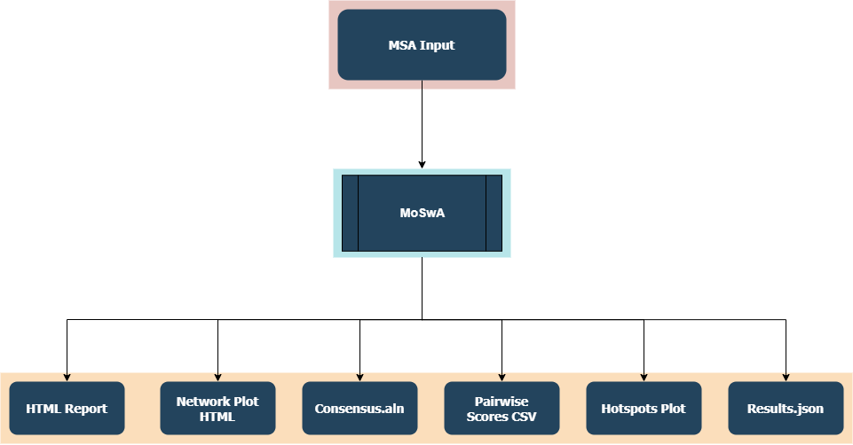

Results
=======

.. _workflow:

The Overall Workflow
--------------------

The overall worflow of MoSwA is illustrated in the Figure below. MoSwA Web as well as the stand alone version will output 6 files. We will describe each of them in here. 

.. _summary:

Short Summary
-------------

You will be directed to short summary report page once the analysis is done. Additionally, the same report is provided as .html file in the stand alone version. At the top of this report a brief statistical summary is reported to the user, including;

  * The input alignment length
  * The highest support for a position
  * The average support
  * The number of positions that have no support. (Absence of k-mer without indel/gaps or unknown amino acids)
  * The number of positions that have low support. (Based on the user defined value)
  * The number of unique (distinctive) switches. A position can have more than one switch. (i.e: switches involving index, major, minor and unique can happen at a single position)
  * The number of total switches.
  
.. _consensus:

Alignment File
--------------

Users are able to view this alignment file in the short summary report, as well as download it in .aln format. This file also produced by the stand alone version. We produce this for two reasons;

  #.  Provide users an alignment view of all the switches observed in a given dataset, referenced against a consensus sequence built from the index sequences of the k-mer positions
  
  #.  When index and major bla bla bla please visit how it works page for more detail
  
.. _network:

Network Plot Topology
---------------------

MoSwA produces a network dot plot to illustrate the complex interaction of motif switches. You can inspect the network plot right on the MoSwA web as well as download it as html file format. MoSwA stand alone produces this as a seperate html file as well. 

The network plot shows only the user defined motif sites (default is all). It should be noted that the positions with a low support value (user defined) are discarded from the network plot. The network can be divided into 4 components;

 #. Downgrading Motifs: 
 
 #. Upgrading Motifs:
 
 #. Positions:
 
 #. Edges:
 
    A. Splits:
    B. Mergers:
