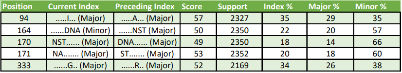

Results
=======

.. _workflow:

The Overall Workflow
--------------------

The overall worflow of MoSwA is illustrated in the Figure below. MoSwA Web as well as the stand alone version will output 6 files. We will describe each of them in here. 

.. figure:: figs/Fig1_v1.png

.. _summary:

Short Summary
-------------

You will be directed to short summary report page once the analysis is done. Additionally, the same report is provided as .html file in the stand alone version. At the top of this report a brief statistical summary is reported to the user, including;

  * The input alignment length
  * The highest support for a position
  * The average support
  * The number of positions that have no support. (Absence of k-mer without indel/gaps or unknown amino acids)
  * The number of positions that have low support. (Based on the user defined value)
  * The number of unique (distinctive) switches. A position can have more than one switch. (i.e: switches involving index, major, minor and unique can happen at a single position)
  * The number of total switches.
  
An example of this part of the MoSwA report is given below. The sample file is analyzed for all the motif ranks (index, major, minor and unique). You can access the sample file and the alignment details from `here <https://github.com/macelik/MoSwADocs/blob/main/docs/source/samplefile/>`_. 

.. raw:: html
    
    <embed type="text/html" src="_static/short.html" width="720" height="420"></embed>
  
.. _consensus:

Alignment File
--------------

Users are able to view this alignment file in the short summary report, as well as download it in .aln format. This file also produced by the stand alone version. We produce this for two reasons;

  #.  Provide users an alignment view of all the switches observed in a given dataset, referenced against a consensus sequence built from the index sequences of the k-mer positions
  
  #.  When index and major bla bla bla please visit how it works page for more detail DO NOT FORGET TO ADD A DESCRIPTION MF
  
Below is the showcase of the alignment view within the short summary page.  
  
.. include:: _static/cons_short.aln
   :literal:
 
.. _network:

Network Plot Topology
---------------------

MoSwA produces a network dot plot to illustrate the complex interaction of motif switches. You can inspect the network plot right on the MoSwA web as well as download it as html file format. MoSwA stand alone produces this as a seperate html file as well. 

The network plot shows only the user defined motif sites (default is all). It should be noted that the positions with a low support value (user defined) are discarded from the network plot. The network graph is dynamic, users can point at a node to see what it is actually representing. Users can download this plot as html file and take advantage of interactive plot or/and they can export the current view of the plot as png. The network can be divided into 5 components;

 **1. Downgrading Motifs:** The higher ranked motif switching to a lower rank such as Index becoming Major (denoted as I => M), Major becoming Minor (denoted as M => Mi) or any loss of the motif which occurs when a motif is present in the previous position but disappears in the subsequent position. Index motif loss is denoted as "I => -". Downgrading motifs are placed at the top lane of the plot as nodes and it follows a hiearchial order, from the most left to right
 
    .. admonition:: Downgrading Motif Order
    
     .. list-table:: 

        * - I => M
          - I => Mi
          - I => U
          - I => -
          - M => Mi
          - M => U
          - M => -
          - Mi => U
          - Mi => -
          - U => -
 

 
 **2. Upgrading Motifs:** The *vice versa* of the downgrading motifs, Major motif becoming Index in the subsequent position (denoted as M => I), Minor becoming Index (denoted as Mi => I) or any gain of the motif, contrary to motif loss. Index motif gain is denoted as "I => +". Upgrading motifs are placed at the bottom lane of the plot as nodes and just like Downgrading motifs, !!it follows the same hiearchial order!!. This allows users to easily spot the direct replacing switches.
 
    .. admonition:: Upgrading Motif Order
    
     .. list-table:: 

        * - M => I
          - Mi => I
          - U => I
          - I => +
          - Mi => M
          - U => M
          - M => +
          - U => Mi
          - Mi => +
          - U => +
 
 **3. Positions:** The positions involving in motif switch are laid at the center as nodes, and the color of these nodes are based on the number of edges. The more edges (switches) in the position, the lighter the color (dark blue to grey).  
 
    The example below is to illustrate. The node that represents 336 is colored light because multiple switches are occuring while position 348 is colored dark blue because it has single switch. 
    
.. figure:: figs/networkpos.png

 FigureCap
 
    Moreoever, when a user hovers over the positions, an information pops up about what kind of switches are happening at the indicated position. You can inspect the example below. How to interpret: HERE IS A LONG EXPLANATION OF 

.. raw:: html
    
    <embed type="text/html" src="_static/motif1.html" width="720" height="470"></embed>
    
htmlcap

   **4. Edges:** ....... set as edges. Grey edges indicate true switches, while others psuedo-switches. 

    **i. Splits:** is when a distinct variant k-mer separates into two or more distinct variants in the subsequent position while preserving its current motif rank. A split causes a drop in the frequency of the motif. Example is given below.
     
     .. figure:: figs/split.png
     
      Index spits two distincs variants while preserving its motif rank (index), and pushing a switch in major rank. 
    
    **ii. Mergers:** is when a two or more distinct k-mer variants of a given incidence at a position combined/merged to become one in the subsequent position. A merger causes an increase in the frequency of the motif. Example is given below.
    
    .. figure:: figs/merge.png
    
     Two distinct minors are merging with the index motif, causing an increase in the frequency of the motif, opposite of a split. 
     
     Below is a more complex mergers example.
     
     .. figure:: figs/merge2.png
     
      Minor_8 and Minor_10 are merging with what was previously a Index motif and causing an increase in the frequency from 129 to 142. However, Minor_2 and Minor_5 are merging with what was previously a Major motif and causing an greater increase in the frequency from 117 to 150. Altough these mergers are what we call pseudo-switches, it gives rise to true switches. The major at the previous position now has the highest frequency and becomes the Index and the Index at the previous position loses its "crown" and becomes a major.

   **5. Legend:** is interactive too, you can double click on a any of the legend to isolate the related trace or single click to hide it. 

    
Network Plot Sample
^^^^^^^^^^^^^^^^^^^

.. Hint:: Double click on the legend number 1 ( I => M indicating Index to Major) and then when you get the isolated trace, do a single click on the second legend ( M => I indicating Major to Index). Now, you will be inspecting only those that are inter-switching between each other. 

.. raw:: html
    
    <embed type="text/html" src="_static/example_network.html" width="720" height="470"></embed>
    
Hotspot Bar Plot
----------------

There are several studies suggesting that certain regions of the gene/genome have a higher proclivity for sequence change. Strong mutation hotspots were discovered in the very first significant collection of mutations within a single gene which is not surprising(`1 <https://pubmed.ncbi.nlm.nih.gov/16590151/>`_). Indeed, there are discovries identified multiple simultaneous mutations occuring in tiny regions while the rest of the gene/genome remains relatively mutation free(`2 <https://www.ncbi.nlm.nih.gov/pmc/articles/PMC4710516/>`_). Since switches refer to mutations, we followed the same ..... We cluster the positions that show motif switches based on the criteria below and later identify the hotspot positions based on the distance between the clusters:

 #. CMSP; is the number of positions that make up a cluster.
 
 #. CS; is the cluster size (minimum is 7)
 
 #. CD; is the distance between clusters.
 
**Example of Cluster and Hotspot Plot**
 
 .. figure:: figs/ClusterHotSpotPlot.png
 
  The starting and ending positions that make up the cluster shown in square brackets as [start::end]. Red rectangle indicates the hot spot.
  
Pairwise Alignment Score
------------------------

Index switch positions are noteworthy due to instability of the index at such positions are possibly to be avoided as vaccine targets, therefore, we provide a pairwise alignment score based on PAM30 for index switches, to determine the physico-checmical spectrum of similarity/variability between the index sequence and the replacing variant motif sequence. These scores are provided along with number of statistical analyses such as the total number of protein sequences analysed at the aligned k-mer position, the percentage of index, major, minor and unique motifs at the given position. This comma-seperated file format allows users to open with any text editor or excel. You can download the file from web-server, stand-alone version produces the same file in the output folder. 

 
 The identical amino acids between the replacing index and the previous index are presented as dots. The "Current Index" column shows the present index motif at the given position, the previous motif rank of the sequence is indicated in paranthesis. "Preceding Index" column shows the index sequence from the previous position and the current motif of the sequence is given within paranthesis.
