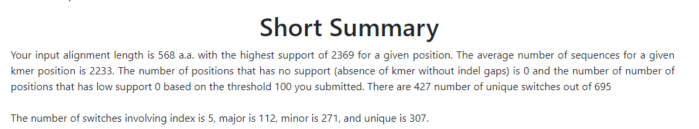
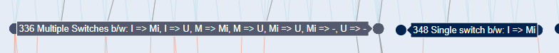

Results
=======

.. _workflow:

The Overall Workflow
--------------------

The overall worflow of MoSwA is illustrated in the Figure below. MoSwA Web as well as the stand alone version will output 6 files. We will describe each of them in here. 

.. figure:: figs/Fig1_v1.png

.. _summary:

Short Summary
-------------

You will be directed to short summary report page once the analysis is done. Additionally, the same report is provided as .html file in the stand alone version. At the top of this report a brief statistical summary is reported to the user, including;

  * The input alignment length
  * The highest support for a position
  * The average support
  * The number of positions that have no support. (Absence of k-mer without indel/gaps or unknown amino acids)
  * The number of positions that have low support. (Based on the user defined value)
  * The number of unique (distinctive) switches. A position can have more than one switch. (i.e: switches involving index, major, minor and unique can happen at a single position)
  * The number of total switches.
  
An example of this part of the MoSwA report is given below. The sample file is analyzed for all the motif ranks (index, major, minor and unique). You can access the sample file and the alignment details from `here <https://github.com/macelik/MoSwADocs/blob/main/docs/source/samplefile/>`_. 

  
.. _consensus:

Alignment File
--------------

Users are able to view this alignment file in the short summary report, as well as download it in .aln format. This file also produced by the stand alone version. We produce this for two reasons;

  #.  Provide users an alignment view of all the switches observed in a given dataset, referenced against a consensus sequence built from the index sequences of the k-mer positions
  
  #.  When index and major bla bla bla please visit how it works page for more detail
  
Below is the showcase of the alignment view within the short summary page.  
  
.. include:: _static/cons_short.aln
   :literal:
 
.. _network:

Network Plot Topology
---------------------

MoSwA produces a network dot plot to illustrate the complex interaction of motif switches. You can inspect the network plot right on the MoSwA web as well as download it as html file format. MoSwA stand alone produces this as a seperate html file as well. 

The network plot shows only the user defined motif sites (default is all). It should be noted that the positions with a low support value (user defined) are discarded from the network plot. The network can be divided into 5 components;

 #. Downgrading Motifs: The higher ranked motif switching to a lower rank such as Index becoming Major (denoted as I => M), Major becoming Minor (denoted as M => Mi) or any loss of the motif which occurs when a motif is present in the previous position but disappears in the subsequent position. Index motif loss is denoted as "I => -". Downgrading motifs are placed at the top of the plot as nodes and it follows a hiearchial order, from the most left to right
 
    .. admonition:: Downgrading Motif Order
 
      +----------++----------++----------++----------++----------++----------++----------++----------++----------++----------+
      |  I => M  ||  I => Mi ||  I => U  ||  I => -  ||  M => Mi ||  M => U  ||  M => -  || Mi => U  || Mi => -  ||  U => -  |
      +----------++----------++----------++----------++----------++----------++----------++----------++----------++----------+
 
 #. Upgrading Motifs: The *vice versa* of the downgrading motifs, Major motif becoming Index in the subsequent position (denoted as M => I), Minor becoming Index (denoted as Mi => I) or any gain of the motif, contrary to motif loss. Index motif gain is denoted as "I => +". Upgrading motifs are placed at the bottom of the plot as nodes and just like Downgrading motifs, !!it follows the same hiearchial order!!. This allows users to easily spot the direct replacing switches.
 
    .. admonition:: Upgrading Motif Order
 
      +----------++----------++----------++----------++----------++----------++----------++----------++----------++----------+
      |  M => I  || Mi => I  ||  U => I  ||  I => +  || Mi => M  ||  U => M  ||  M => +  ||  U => Mi || Mi => +  ||  U => +  |
      +----------++----------++----------++----------++----------++----------++----------++----------++----------++----------+
 
 #. Positions: The positions involving in motif switch are laid at the center as nodes, and the color of these nodes are based on the number of edges. The more edges (switches) in the position, the lighter the color (dark blue to grey).  
 
    The example below is to illustrate. The node that represents 336 is colored light because multiple switches are occuring while position 348 is colored dark blue because it has single switch. 
    

 FigureCap
 
    Moreoever, when a user hovers over the positions, an information pops up about what kind of switches are happening at the indicated position. You can inspect the example below. How to interpret: HERE IS A LONG EXPLANATION OF 

.. raw:: html

    <embed type="text/html" src="_static/motif1.html" width="720" height="550"></embed>
    
    
 #. Edges:

    a. Splits:
    b. Mergers:

 #. Legend: 
