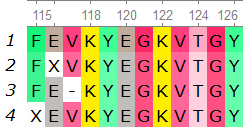

Usage
=====

.. _webservice:

Web Service
-----------

All you need to do is upload your aligned fasta file to `MoSwA WebService <http://moswa.bioinfo.perdanauniversity.edu.my/>`_. There are three main parameters to be supplied, altough we have default values. 

   -  Motif sites: You can select any motif site(s) to be analyzed. Default is all the motifs (index,major, minor and unique) to be analyzed and reported. 
   -  k-mer size: Value to be applied for the sliding window of k. Default value is 9, simply because it is typically used for immunological applications, such as measure of antigenic diversity
   -  Low support: Alignment positions within the k-mer length that contain any gap, or unknown amino acid is not considered for the related position. These sequences might drop the support value and can result in artificial diversity/motif measures. Thus, MoSwA tags those low support positions that exhibit motif switches and indicate such positions in the alignment view file while discard these positions on the network and hotspot plots.

In the example below, there are 4 sequences from position 115 to 126. If we are using k-mer size 9, position 115 will have only support of 1, because the other sequences has either a gap or an unknown amino acid within the k-mer size. However, at position 116, the support will increase to 2 as the last sequence in the figure will now be considered, and position 117 and 118 will have support of 3 and 4 respectively. 

.. _install:

Install Standalone
----------------------------------

To retrieve a list of random ingredients,
you can use the ``lumache.get_random_ingredients()`` function:

.. autofunction:: lumache.get_random_ingredients

The ``kind`` parameter should be either ``"meat"``, ``"fish"``,
or ``"veggies"``. Otherwise, :py:func:`lumache.get_random_ingredients`
will raise an exception.

.. autoexception:: lumache.InvalidKindError

For example:

>>> import lumache
>>> lumache.get_random_ingredients()
['shells', 'gorgonzola', 'parsley']

